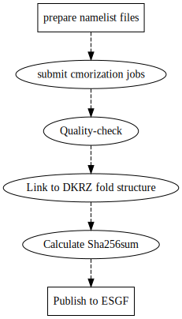

# Workflow to do the CMORIZATION

## 0 - Preparation
(Note: I have downloaded and installed/build noresm2cmor at `NIRD: /projects/NS9560K/cmor/noresm2cmor`, so if you don't plan to install your own copy, you can skip the step 0.1 and 0.2 and go directly to step 0.3)

### 0.1 - Download
```bash
# assume the noresm2cmor3 will install under your home folder
cd ~
git clone https://github.com/NorwegianClimateCentre/noresm2cmor
```

### 0.2 - Build
```bash
cd noresm2cmor/build/
# make serial executable
make -f Makefile_cmor3.nird_intel
# make mpi executable
make -f Makefile_cmor3mpi.nird_intel
```

Then the executables `noresm2cmor3` and `noresm2cmor3_mpi` are find under `noresm2cmor/bin`

### 0.3 - Set up the enviroment varialbe
Set the path where noresm2cmor is installed. Paste following statements to your `~/.bashrc`

```bash
export CMOR_ROOT=/projects/NS9560K/cmor/noresm2cmor
```

or set the following if your installed your own copy at your home folder

```bash
export CMOR_ROOT=~/noresm2cmor
```

Then apply the setting by executing:

```bash
source ~/.bashrc
```

## 1 - Create and submit cmorization job
Assume you are processing experiment **piClim-histall** of **NorESM2-LM** with cmor data version **v20191108b**. Therefore, I use here three SHELL variables to represent for these parameters:

```bash
model=NorESM2-LM
expid=piClim-histall
version=v20191108b
```

(Note, **v20191108b** contains a subset of supported fields of **v20191108** compared to **v20190920**, the suffix `b` is only used where its origional cmorized outut is store, i.e, `/projects/NS9034K/CMIP6/.cmorout`; the suffix is trim, i.e., v20191108 is used when link to DKRZ folder structure)
### 1.1 - Create template namelist files for each model casename

First create a folder for each `expid`

```bash
mkdir -p ${CMOR_ROOT}/namelists/CMIP6_${model}/${expid}/template
cd ${CMOR_ROOT}/namelists/CMIP6_${model}/${expid}/template
```

### 1.1.1 - Create exp.nml

Then one should create mannually a namelist file for the each CASENAME (note, one experiment may have several CASES).

This file contains the information on the `casename`, the folder path where the cmorized data been store `osubdir`, the `experiment_id`, `activity_id`, `realisation`, etc

As an exmaple here, for `expid=piClim-histall` of `NorESM2-LM`, the basic information is found at its corresponding GitHub Issues, here [Issue 86 for realisation 1](https://github.com/NorwegianClimateCentre/noresm2cmor/issues/86), and [Issue 90 for realisation 2](https://github.com/NorwegianClimateCentre/noresm2cmor/issues/90)

Three namelist files are therefore created under `${CMOR_ROOT}/namelists/CMIP6_${model}/${expid}/template`:

```
exp_NFHISTnorpibc_f19_20190810.nml
exp_NFHISTnorpibc_02_f19_20190909.nml
```

>Tips:
>1. Some previously created case namelist files of the same `activity id` (e.g., CMIP, AerChemMIP) can be used as template for the new name lists, for example, we can take exp_*.nml under `${CMOR_ROOT}/namelists/CMIP6_NorESM2-LM/ssp126/template` as template file.
>2. `grep` the $expid in ${CMOR_ROOT}/tables/CMIP6_CV.json, and one can find some of the correct settings for that $expid

### 1.1.2 - Create sys.nml
This file contains the informatin on where the model outpout is `ibasedir`, the base path where cmorized output is stored and etc.

A `sys.nml` is created also under: `${CMOR_ROOT}/namelists/CMIP6_${model}/${expid}/template`

Note: if there are several case names and some of them are store under different project area, there should be several sys*.nml files with corresponding names as `sysNS2345K.nml`, `sysNS9560K.nml`, `sysNS9560KFRAM.nml`,`sysipcc.nml`. The suffix `NS2345K`, `NS9560KFRAM` etc will be set as parameter during submiting the cmorization jobs (explained below).

### 1.1.3 - Copy mod.nml
```bash
cp ${CMOR_ROOT}/namelist/mod_CMIP6_${model}.nml mod.nml
```

### 1.1.4 - Copy var.nml
```bash
cp ${CMOR_ROOT}/namelist/var_CMIP6_NorESM2_default.nml var.nml
```

Note: `{CMOR_ROOT}/namelist/var_CMIP6_NorESM2_default.nml` is the full list of latest supported variables. This means all the fields in `var.nml` will be cmorized if they are presented in the model ouput.

### 1.2 - Create folder of certain data verson

The folder to store namelist settings of each data version.

Again, assume we are using the `expid=v20191108b`

```bash
mkdir -p ${CMOR_ROOT}/namelists/CMIP6_${model}/${expid}/${version}
cd ${CMOR_ROOT}/namelists/CMIP6_${model}/${expid}/${version}
cp ../template/{mod.nml,sys.nml,var.nml} .
```

Note: if you only need to cmorize only a subset of the supported variables, you should named it as another data version, e.g., `v20191108b`, and copy for example from `piControl/v20191108b/var.nml`. If you want to make some other changes, also make a new folder of the data version, and change the var.nml accordingly.

### 1.3 - Create cmor.sh

Create a bash script `cmor.sh` under: `${CMOR_ROOT}/namelists/CMIP6_${model}/${expid}`.

This script sets the time periods of the model output to be cmorized, and also pass the `casename`,`expid`, `version` etc, and settings if run serial or parallel version of noresm2cmor3 tool. Some of the parameters in the scripts is optional, for example, `-mpi=DMPI` to run parallelly; `-p=NS9560KFRAM` to if `sysNS9560K.nml` instead of `sys.nml` is used.

This script basically does two tasks:
1. submit the cmorization job, `runcmor -c=$CaseName -m=$model -e=$expid -v=$version -r=$real -yrs1="${years1[*]}" -yrs2="${years2[*]} ..."`
2. PrePARE QC check, create links and update sha256sum, `cmorPost.sh -m=${model} -e=${expid} -v=${version} --verbose=false`

### 1.4 Submit the job
Still, assume we are doing cmorization for `model=NorESM2-LM`, `expid=piClim-histall`,`version=v20191108b`, we submit the job by:

```bash
cd ${CMOR_ROOT}/namelists/CMIP6_${model}/${expid}/
./cmor.sh -m=NorESM2-LM -e=piClim-histall -v=v20191108b &>>logs/cmor.log.v20191108b &
```

If luckily enough, the job will fully finish, and will call the `cmorPost.sh` file to have the quality-check (`cmorQC.sh`), making links (`cmorLink.sh`), and calculate sha256sum (`cmorSha256sum.sh`)

The next Step 2 check if the cmorization is complete.

## 2 - Check the cmorized results

### 2.1 - Check the number of files of cmorized output

```bash
cd ${CMOR_ROOT}/namelists/CMIP6_${model}/${expid}/
```
Create a scriipt `checkcmorout.sh` which include the information of segments of years of cmorized experiments and so on. One can use template from previous experiments, and also the years segements information in `cmor.sh`

execute the script, and it gives on overview of the cmorized files for each years periods and for different experiment realisations.
```bash
./checkcmorout.sh
```

If it pops out a list a **Wrong files**, this usually means the job stopped abnormally, and one should press 'Y' to remove these wrong files.

Note, DO NOT remove the "Wrong files" while the job is still running, since they are likely just the temparary files.

Usually, each year period should have the same number of cmorized output. Otherwise, it may not complete. You should check furthr steps.

### 2.1 - Runtime log files
There are two places of stored log files:

* `${CMOR_ROOT}/namelists/CMIP6_${model}/${expid}/logs/cmor.log.${version}`, in which you find a precise information of progress
* `${CMOR_ROOT}/logs/CMIP6_${model}/${expid}/${version}/${year1}-${year2}.{log,err}`, in which you find verbosed log of the cmorization. You can see if there shows `Errors` or have `ALL DONE`, and the latter usually a indication of successful and complete cmorization job.

### 2.2 - PrePARE quality-check log
If the cmorization is complete and successfuly, there will be two Quality-check log files:

`/tos-project1/NS9034K/CMIP6/.cmorout/NorESM2-LM/piClim-histall`

* v20191108b.QCreport
* v20191108b.QCreportlong

One should check if there are `0 error(s)` in `v20191108b.QCreport`

If there is errors, check `v20191108b.QCreportlong` what is the error.

If there is no error, go to the next step.

### 2.3 - Check logs of linking files
Under `/tos-project1/NS9034K/CMIP6/.cmorout/NorESM2-LM/piClim-histall`, there is log file `v20191108b.links` showing which files has been linked to the DKRZ folder structure, for example, here under:

```
/tos-project1/NS9034K/CMIP6/ScenarioMIP/NCC/NorESM2-LM/piClim-histall`
```

Check if the number of files in this file is identical to the *.QCreport file

### 2.4 - Check if the sha256sum caclulated

Go to `/tos-project1/NS9034K/CMIP6/ScenarioMIP/NCC/NorESM2-LM/piClim-histall`
There should be hidden files:

* .r1i1p1f1.sha256sum_v20191108b
* .r2i1p1f1.sha256sum_v20191108b
* .r3i1p1f1.sha256sum_v20191108b

(each realisation has a seperate sha256sum files)

Check the number of files in these sha256sum files to see if they are identical to the QCreport log, the number of linked files, and also the output from the  `./checkcmorout.sh`

---
If there are errors identified above, then go to Step 4 to resubmit the job


## 3 - Update Github issue to publish the data

* Post on the corresponding issue [Issue 86 for realisation 1](https://github.com/NorwegianClimateCentre/noresm2cmor/issues/86), and [Issue 90 for realisation 2](https://github.com/NorwegianClimateCentre/noresm2cmor/issues/90) on the cmorized data, and request to publish
* Change the **Label** from _CMORize_ to _ESGF publish_
* If the issues is of status **closed**, reopen the issue
Once the ESGF publish is finished, the Issue will be closed again.

(If there are new cmorization for this experiment, the issue can be opened again)

## 4 - Redo the CMORization for uncompleted experiments

### 4.1 - resumit job
```bash
cd ${CMOR_ROOT}/namelists/CMIP6_${model}/${expid}/
# make a temperary cmo.sh file
cp cmor.sh cmor_tmp.sh
```

Then edit cmor_tmp.sh and only keep the years of periods that are not completed, and submit again

```bash
./cmor_tmp.sh -m=NorESM2-LM -e=piClim-histall -v=v20191108b &>>logs/cmor.log.v20191108b &
```

Again, if there is no crash, `cmorPost.sh` called inside `cmor.sh` should quality-check and calculated sha256sum etc, and one can go back to Step 3.

If CMORization is successful, but some of the proceedure in `cmorPost.sh` is not, then you should redo the `cmorPost.sh`:

```bash
cd ${CMOR_ROOT}/workflow
cmorPost.sh -m=${model} -e=${expid} -v=${version}
```
or go the next individual procedures, step by step (no error in the first step, then proceed to the next)

### 4.2 - PrePARE quality-check
```bash
./cmorQC -m=$model -e=$expid -v=$version
```

### 4.3 - Making links
```bash
./cmorLink.sh -m=$model -e=$expid -v=$version
```

### 4.4 - Calculate sha256sum
```bash
./cmorSha256sum.sh -m=$model -e=$expid -v=$version
```

If the above procedure are complete without error, go to the Step 3.

## 5 - Other notes

## 5.1 - Manage many jobs
There is wrapper script file `$CMOR_ROOT/workflow/cmorWrapper.sh` that is used to manage many jobs of different experiments, model, versions on different NIRD nodes.

First, one should login to specific login node of nird for example,

```bash
ssh username@login0.sigma2.nird.no
```

This is useful when the jobs can runs continuously without program crash or NIRD system crashes (which usually happens).

NOTE: Be cautious not to submit jobs that is alreay finished or are running.

## 5.2 - Queuing of jobs
I set the maximumn running noresm2cmor jobs as 8 to avoid overload of the system and crashes. Therefore, when the job is submitted by `cmor.sh` (or `cmorWrapper.sh`), it will check if there are already more than 8 running jobs, if so it will not start immediately. Just wait as long it has the `cmor.sh` job running.

---
A simple flowchart of the workflow:



